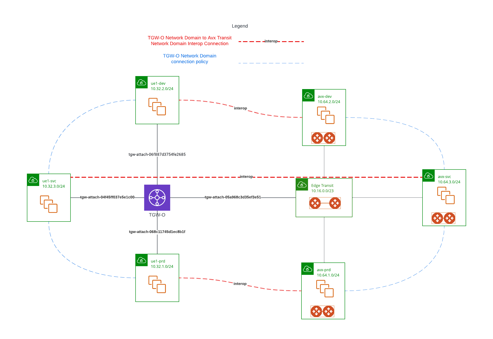
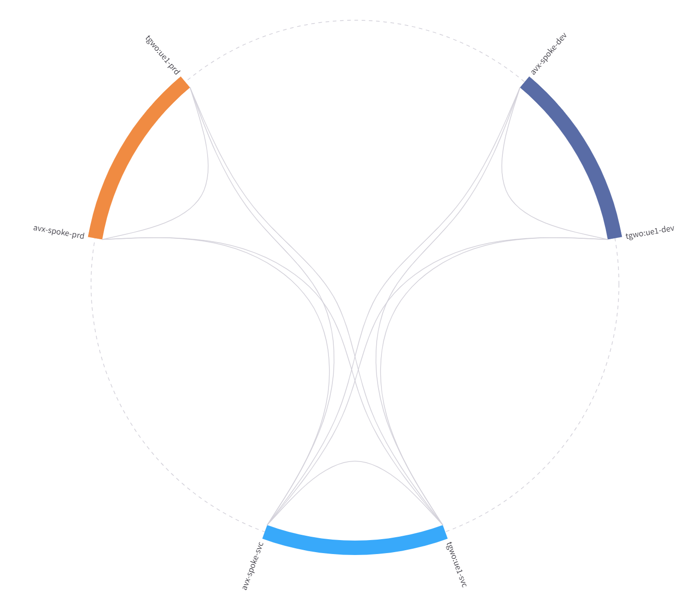

# TGW-O Network Domain to Avx Transit Network Domain interop
This repo creates TGW-O network domains that interop with Avx Transit Network domain

## Architecture

## TGW-O side
TGW-O have three VPCs: ue1-dev, ue1-prd, ue1-svc, they each belong to their own network domain

Network domain ue1-svc have connection policies to both ue1-dev and ue1-prd

Network domain Edge_Domain have connection policy to  ue1-dev, ue1-prd, ue1-svc

## Avx Edge Transit side
Three spokes:

- avx-spoke-dev belongs to network domain: avx-dev

- avx-spoke-prd belongs to network domain: avx-prd

- avx-spoke-svc belongs to network domain: avx-prd

Network domain: avx-svc has connection policies to both avx-dev, avx-prd

## Interop
- tgwo:ue1-dev is connected to avx-spoke-dev via netwok domain avx-dev

- tgwo:ue1-prd is connected to avx-spoke-prd via netwok domain avx-prd

- tgwo:ue1-svc is connected to avx-spoke-svc via netwok domain avx-svc

## Network Segementation view

## TGW FireNet

- TGW-O FireNet is created, but won't work with interop
- Once interop is in place, when you try to add Edge_Domain or TGW-O Network domain for inspection, following error would occure:

    - Error: [AVXERR-TGW-0085] TGW domain Aviatrix_Edge_Domain or its connected route domain is associated with transit network domain. It is not allowed to connect to firenet or egress domain security.

    - Error: [AVXERR-TGW-0085] TGW domain ue1-dev or its connected route domain is associated with transit network domain. It is not allowed to connect to firenet or egress domain security.